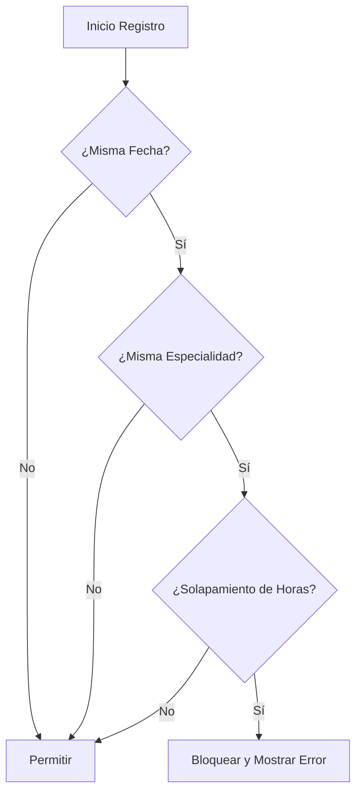

# 🧠 Lógica de Negocio de la Agenda Médica

**Responsable:** Carlos Benavides (Ingeniero de Requerimientos)  
**Proyecto:** GestionAPP  

---

## 1. Algoritmo de Validación de Disponibilidad
El corazón del sistema es evitar que dos médicos de la misma especialidad atiendan en el mismo bloque horario.

**Lógica de Solapamiento:**
*   Se bloquea si: `(Nueva_Inicio < Existente_Fin) AND (Nueva_Fin > Existente_Inicio)`.
*   **Regla de Oro:** Se permiten **horarios consecutivos**. Si un bloque termina a las 10:00, otro puede empezar exactamente a las 10:00 sin generar conflicto.

---

## 2. Reglas de Negocio en FullCalendar
La visualización en el calendario interactivo debe seguir este estándar cromático para facilitar la lectura al médico:

| Estado | Color Hex | Significado |
| :--- | :--- | :--- |
| **Disponible** | `#28a745` (Verde) | Horario libre para agendamiento. |
| **Ocupado / Cita** | `#dc3545` (Rojo) | El espacio ya tiene un paciente asignado. |
| **Pasado** | `#6c757d` (Gris) | Horarios que ya ocurrieron. |

---

## 3. Diagrama de Flujo (Lógica de Traslapes)

---
*Documentación oficial de lógica de negocio - Carlos Benavides.*
